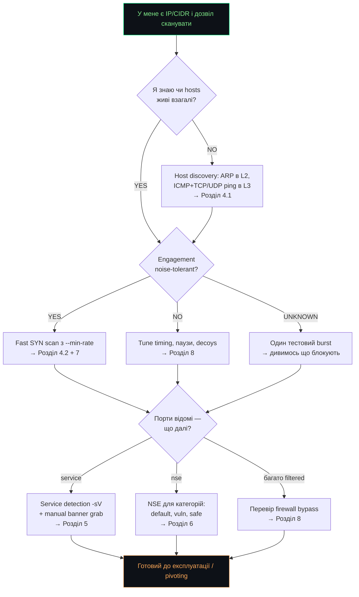
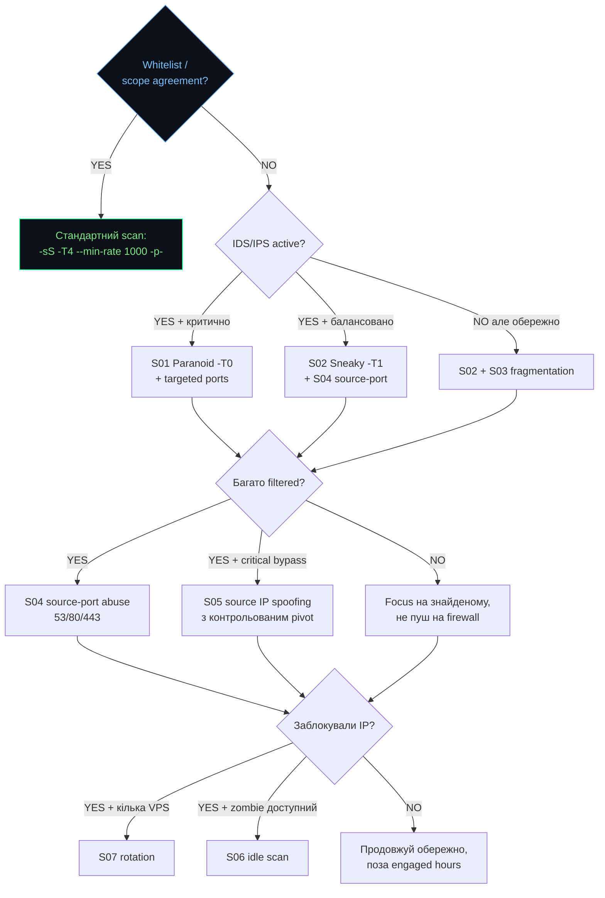

# Network Enumeration with Nmap

> Польовий довідник пентестера: тріаж, сканування, обхід firewall/IDS  
> На основі HTB Academy · версія 1.0 · 2026

---

## ⚠ Legal Notice

> [!CAUTION]
> Цей матеріал призначений виключно для навчання та для робіт у межах підписаного scope.
> Активне сканування мереж без письмового дозволу власника інфраструктури є кримінальним
> правопорушенням у більшості юрисдикцій (КК України ст. 361, CFAA у США, Computer Misuse
> Act у UK). Stealth-техніки (decoys, source-port spoofing, fragmentation) **не роблять**
> несанкціоноване сканування законним — вони лише ускладнюють атрибуцію.

---

## Зміст

- [Майстер-флоучарт](#майстер-флоучарт)
- [1. Вступ і методологія](#1-вступ-і-методологія)
- [2. Тріаж за 5-10 хвилин](#2-тріаж-за-5-10-хвилин)
- [3. Повне перерахування (V01-V14)](#3-повне-перерахування-v01-v14)
- [4. Host & Port Scanning — механіка](#4-host--port-scanning--механіка)
- [5. Service & Version Detection](#5-service--version-detection)
- [6. Nmap Scripting Engine (NSE)](#6-nmap-scripting-engine-nse)
- [7. Performance Tuning](#7-performance-tuning)
- [8. Firewall & IDS/IPS Evasion](#8-firewall--idsips-evasion)
- [9. Stealth Playbook — 7 сценаріїв непомітного сканування](#9-stealth-playbook--7-сценаріїв-непомітного-сканування)
- [Післямова](#післямова)

---

## Майстер-флоучарт

Перш ніж відкривати конкретний розділ — пройди це дерево рішень. Воно за 30 секунд
скаже куди йти далі залежно від ситуації.



---

## 1. Вступ і методологія

### 1.1 Послідовність дій пентестера

Network enumeration — це фундамент. Без точної мапи мережі (живі hosts, відкриті порти,
версії сервісів, OS) подальший pentest перетворюється на гадання. Nmap — швейцарський ніж
для цього етапу, але як кожен інструмент, він шумить пропорційно тому, як грубо ним
користуватись.

Робочий цикл, якого варто триматись на кожному engagement:

| # | Крок | Що робимо |
|---|---|---|
| 1 | **Scope** | підтвердити IP-діапазон, дозволені/заборонені дії, time window |
| 2 | **Host discovery** | ARP в L2, або ICMP+TCP/UDP combo в L3 |
| 3 | **Quick port scan** | top-100/1000, SYN scan; `-p-` запускаємо у фоні |
| 4 | **Service detection** | `-sV` + manual banner grab для критичних сервісів |
| 5 | **NSE + vuln mapping** | категорії `default`, `safe`, `vuln`; `vulners` → CVE |
| 6 | **Save everything** | `-oA <name>` завжди — `.xml`/`.gnmap`/`.nmap` |

### 1.2 Легенда умовних позначень

```bash
root@htb:~# nmap -sS 10.129.2.28
```
_▸ bash/zsh команда (root)_

```powershell
PS C:\> Get-NetTCPConnection
```
_▸ PowerShell_

```sh
user@kali:~$ ncat -nv 10.129.2.28 25
```
_▸ non-privileged shell або interactive tool_

```text
PORT   STATE SERVICE
22/tcp open  ssh
```
_▸ реальний вивід команди_

> [!TIP]
> Зелений TIP — практична порада з поля.

> [!WARNING]
> Червоний УВАГА — техніка створює помітний шум або псує дані.

> [!NOTE]
> Синій ℹ — пояснення механіки "чому саме так".

> [!IMPORTANT]
> ЧЕКАТИ — команда йде довго, не панікуй.

**Decision-блок** виглядає так:

> **? Decision-блок — приклад**
> - ✓ **YES** → куди йти, якщо умова виконана
> - ✗ **NO** → альтернативний шлях
> - ~ **MAYBE** → проміжний варіант, потрібна додаткова перевірка

---

## 2. Тріаж за 5-10 хвилин

> [!NOTE]
> **Коли застосовується.** Ти щойно отримав ціль (IP/CIDR/list). Не знаєш ні живих hosts,
> ні портів, ні сервісів. Ціль наступних 5-10 хвилин — швидко скласти первинну мапу і
> вирішити куди копати глибше.

### 2.1 Стратегічна карта векторів

| Вектор | Що дає | Шум | Пріоритет |
|---|---|---|:---:|
| ARP ping (L2) | живі hosts у тій самій підмережі | низький | **HIGH** |
| SYN scan top-1000 | відкриті TCP порти за хвилини | середній | **HIGH** |
| `-sV` service detection | назви + версії сервісів → CVE | середній | **HIGH** |
| NSE `default` | banners, basic enum, public info | середній | **HIGH** |
| NSE `vuln` | CVE по CPE, відомі misconfigs | високий | MED |
| UDP scan top-100 | SNMP, DNS, NetBIOS, IKE | низький, повільний | MED |
| Full TCP `-p-` | порти на нестандартних номерах | середній | MED |
| OS detection `-O` | fingerprint OS | середній | MED |
| ACK scan `-sA` | мапа firewall rules | низький | MED |
| Decoys / source-port | обхід IDS/IPS | залежить | LOW |
| Idle scan `-sI` | scan чужими руками | дуже низький | LOW |

### 2.2 5 кроків швидкої перевірки

#### Крок 1 · Host discovery — хто взагалі живий?

```bash
sudo nmap 10.129.2.0/24 -sn -oA tnet | grep for | cut -d" " -f5
```
```text
10.129.2.4
10.129.2.10
10.129.2.11
10.129.2.18
10.129.2.19
10.129.2.20
10.129.2.28
```
_▸ 7 живих hosts; `-sn` вимикає port scan; `-oA` зберігає у 3 форматах_

```bash
sudo nmap 10.129.2.18 -sn -PE --packet-trace --disable-arp-ping
```
```text
SENT (0.0107s) ICMP [10.10.14.2 > 10.129.2.18 Echo request (type=8/code=0) id=13607 seq=0]
RCVD (0.0152s) ICMP [10.129.2.18 > 10.10.14.2 Echo reply (type=0/code=0) id=13607 seq=0]
Host is up (0.086s latency).
```
_▸ `--disable-arp-ping` змушує реальний ICMP echo замість ARP_

> [!NOTE]
> У L2 Nmap завжди робить ARP ping першим — це швидше і ICMP-блокування на host
> не заважає. Якщо firewall блокує ICMP echo — у тій самій підмережі ARP все одно працює.

> **? Hosts знайдено?**
> - ✓ **YES** → переходимо до **кроку 2** (port scan)
> - ✗ **NO** → це L3 і ICMP заблокований? Спробуй `-PS22,80,443 -PA80,443 -PU53,161`
> - ~ **MAYBE** → робимо наступні кроки на знайдених, паралельно widen probes

#### Крок 2 · Quick TCP scan — top 100 портів

Не запускай `-p-` першим. Спочатку швидкий top-100 щоб побачити "поверхню": що там за hostи
(web/SMB/SMTP/SQL/RDP). На цьому етапі вже видно тип системи.

```bash
sudo nmap 10.129.2.28 --top-ports=100 -oA quick
```
```text
PORT     STATE    SERVICE
21/tcp   closed   ftp
22/tcp   open     ssh
23/tcp   closed   telnet
25/tcp   open     smtp
80/tcp   open     http
110/tcp  open     pop3
139/tcp  filtered netbios-ssn
443/tcp  closed   https
445/tcp  filtered microsoft-ds
3389/tcp closed   ms-wbt-server
```
_▸ SSH+SMTP+HTTP+POP3 + filtered SMB → схоже на Linux mail-сервер з firewall_

> [!TIP]
> Запусти `-p- --min-rate 1000 -oA full &` у фоні поки робиш кроки 3-5.
> Коли дійдеш до Service Detection — повний scan вже готовий.

> **? Що бачимо у top-100?**
> - ✓ **YES** Багато open → запам'ятай і переходь до **кроку 3**
> - ✗ **NO** Все closed/filtered → host точно живий? Перевір `--reason`
> - ~ **MAYBE** Є filtered → firewall у грі. Тримай у голові для **розділу 8**

#### Крок 3 · Service & Version Detection

На знайдені open порти — `-sV`. Це дає назви сервісів + версії, які потім мапляться
на CVE. Без точної версії exploit search перетворюється на гадання.

```bash
sudo nmap 10.129.2.28 -p 22,25,80,110,143,993,995 -sV
```
```text
PORT      STATE    SERVICE      VERSION
22/tcp    open     ssh          OpenSSH 7.6p1 Ubuntu 4ubuntu0.3 (Ubuntu Linux; protocol 2.0)
25/tcp    open     smtp         Postfix smtpd
80/tcp    open     http         Apache httpd 2.4.29 ((Ubuntu))
110/tcp   open     pop3         Dovecot pop3d
143/tcp   open     imap         Dovecot imapd (Ubuntu)
993/tcp   open     ssl/imap     Dovecot imapd (Ubuntu)
995/tcp   open     ssl/pop3     Dovecot pop3d
Service Info: Host:  inlane; OS: Linux; CPE: cpe:/o:linux:linux_kernel
```
_▸ OpenSSH 7.6p1 + Apache 2.4.29 — обидва Ubuntu 18.04 vintage; шукай LPE на kernel_

> [!WARNING]
> `-sV` часто **не** виносить деталі з banner у фінальний звіт. Завжди дублюй вручну
> через `nc -nv host port` для критичних сервісів.

```sh
user@kali:~$ nc -nv 10.129.2.28 25
```
```text
Connection to 10.129.2.28 port 25 [tcp/*] succeeded!
220 inlane ESMTP Postfix (Ubuntu)
```
_▸ "(Ubuntu)" у banner — Nmap це проковтнув, ручний grab показав_

> **? Версії з'ясовані?**
> - ✓ **YES** → переходимо до **кроку 4** (NSE)
> - ✗ **NO** Banner порожній → Nmap використав signature matching, перевір `--version-intensity 9`
> - ~ **MAYBE** Версія є але "generic" → manual probe (curl, ncat, smtp HELO)

#### Крок 4 · NSE для discovery + vuln

NSE — це 600+ Lua-скриптів які витискають з сервісу більше, ніж дає звичайний banner.
На етапі тріажу запускай тільки `default` + `safe` категорії або конкретні скрипти за сервісом.

```bash
sudo nmap 10.129.2.28 -p 25 --script banner,smtp-commands
```
```text
PORT   STATE SERVICE
25/tcp open  smtp
|_banner: 220 inlane ESMTP Postfix (Ubuntu)
|_smtp-commands: inlane, PIPELINING, SIZE 10240000, VRFY, ETRN, STARTTLS, ENHANCEDSTATUSCODES,
                 8BITMIME, DSN, SMTPUTF8,
```
_▸ VRFY = можна перерахувати users; STARTTLS = можна перейти на TLS_

```bash
sudo nmap 10.129.2.28 -p 80 -sV --script vuln
```
```text
| http-enum:
|   /wp-login.php: Possible admin folder
|   /: WordPress version: 5.3.4
|_  /readme.html: Interesting, a readme.
| http-wordpress-users:
| Username found: admin
| vulners:
|   cpe:/a:apache:http_server:2.4.29:
|       CVE-2019-0211   7.2 https://vulners.com/cve/CVE-2019-0211
|       CVE-2018-1312   6.8 https://vulners.com/cve/CVE-2018-1312
|       CVE-2017-15715  6.8 https://vulners.com/cve/CVE-2017-15715
```
_▸ WordPress 5.3.4 + admin user знайдено + 3 Apache CVE → вектор атаки готовий_

> [!WARNING]
> Категорія `vuln` робить багато probes (HTTP requests, SMB checks). WAF/IDS це бачить.
> На реальному engagement — після `vuln` чекай блокування.

> **? Знайдено vulnerability чи misconfiguration?**
> - ✓ **YES** → крок 5 (firewall mapping) і паралельно — exploit research
> - ✗ **NO** Скрипти нічого не дали → version-based search в `searchsploit` вручну
> - ~ **MAYBE** Підозрілі rate-limit responses → IPS детектить, переходь до **розділу 9**

#### Крок 5 · Firewall fingerprint — що дозволено?

Якщо у попередніх кроках бачив filtered порти — настав час зрозуміти ЯК firewall фільтрує.
ACK scan не визначає open/closed, але мапить firewall rules: які порти firewall взагалі
пропускає (unfiltered) vs які блокує (filtered).

```bash
sudo nmap 10.129.2.28 -p 21,22,25,139,445 -sA -Pn
```
```text
PORT    STATE      SERVICE
21/tcp  filtered   ftp
22/tcp  unfiltered ssh
25/tcp  filtered   smtp
139/tcp filtered   netbios-ssn
445/tcp filtered   microsoft-ds
```
_▸ unfiltered на 22 = firewall пропускає; filtered на 25/139/445 = блокує_

> [!TIP]
> Якщо багато filtered — спробуй `--source-port 53`. Багато адмінів залишають TCP/53
> у trust-list для DNS і forgot про це. Це найпопулярніший stealth bypass на HTB.

> **? Firewall блокує цікаві порти?**
> - ✓ **YES** → **розділ 9** (Stealth Playbook) + спробуй source-port tricks
> - ✗ **NO** → фокусуй на сервісах, які вже працюють
> - ~ **MAYBE** Частина filtered можливо drop, частина reject → перевір `--packet-trace`

### 2.3 Карта "Що я бачу → куди йти"

| Що бачиш | Що це означає | Куди йти |
|---|---|---|
| `Host is up (0.0X latency)` | ARP/ICMP reply отримано | port scan → крок 2 |
| Усі hosts `down` | L3 без ICMP, ARP не працює | `-PS80,443 -PA80,443` |
| `filtered` на 1-2 портах | індивідуальні firewall rules | ACK scan → 8.1 |
| `filtered` на більшості | агресивний firewall | Stealth → розділ 9 |
| `open\|filtered` (UDP) | немає response (норма для UDP) | `-sV --version-intensity 0` |
| `RST/ACK` в trace | порт closed (firewall propagate) | скіпай порт |
| `ICMP type 3 code 3` | port unreachable, firewall reject | порт закритий за rule |
| `ICMP type 3 code 13` | admin prohibit (firewall видно) | shrugs; знаємо що блокує |
| `220 ESMTP Postfix` | SMTP relay, можливо open | `VRFY user enum` |
| `SSH-2.0-OpenSSH_X.Y` | точна версія | `searchsploit OpenSSH X.Y` |
| Apache + WordPress | web app stack | wpscan, dirsearch, BurpSuite |
| SMB filtered | SMB у внутрішній мережі | спробуй з whitelisted host |
| `OS: Linux 2.6.X` | старе ядро | kernel exploits (DirtyCow etc) |
| scan дуже повільний | багато filtered + retries | `--max-retries 1` |
| RST на ACK scan | порт unfiltered (доступний) | SYN scan для open/closed |
| Раптом всі hosts down | тебе заблокували | VPS rotation, розділ 9.7 |

### 2.4 Принципи роботи у полі

**Завжди зберігай результати.** `-oA <basename>` у кожному запуску. Коштує нічого, рятує
життя при diff-аналізі і репортингу. `.xml` йде в Metasploit/Faraday, `.gnmap` — в grep,
`.nmap` — людському оку.

**Не довіряй "автоматичному" output.** Nmap — не оракул. `-sV` ковтає половину banner.
`-O` часто помиляється на "Linux 2.6". `vulners` мапить по CPE, не по реальній версії
патчу. Завжди перевіряй вручну.

**Швидкість vs повнота — це trade-off.** `--min-rate 5000 -T5` на HTB працює. У реальному
engagement — отримаєш false negatives і блокування. Default `-T3` існує не просто так.

**Шум = атрибуція.** Кожен probe з твого IP. Якщо engagement не whitelisted — рахуй кожен
пакет. Decoys і source-port spoofing допомагають, але не роблять scan "невидимим" — вони
ускладнюють attribution, не виключають його.

**Слухай мережу.** Якщо раптово все стало down/filtered — тебе заблокували. Не біси
firewall повторами з того ж IP. Меняй pivot або стій на паузі.

---
## 3. Повне перерахування (V01-V14)

> [!NOTE]
> **Коли застосовується.** Тріаж дав попередню картину; тепер ми йдемо системно за **цілями**:
> знайти живі hosts, знайти всі відкриті порти, ідентифікувати сервіси/версії, знайти
> vulnerabilities. Кожен V## — один конкретний вектор з командою, output, hint і пріоритетом.

### Ціль: визначити живі hosts

#### V01 · ARP ping (L2 sweep) — `HIGH`

| | |
|---|---|
| **Ціль** | знайти живі hosts у тій самій підмережі |
| **Наступний крок** | port scan на знайдених (V03) |

```bash
sudo nmap 10.129.2.0/24 -sn -oA tnet | grep for | cut -d" " -f5
```
```text
10.129.2.4
10.129.2.10
10.129.2.11
10.129.2.18
10.129.2.19
10.129.2.20
10.129.2.28
```
_▸ Nmap у L2 робить ARP ping автоматично; ICMP блокування не заважає_

#### V02 · ICMP/TCP/UDP ping combo (L3) — `HIGH`

| | |
|---|---|
| **Ціль** | живі hosts у L3 коли ICMP заблокований |
| **Наступний крок** | port scan (V03/V04) |

```bash
sudo nmap -sn -PE -PS22,80,443 -PA80,443 -PU53,161 10.129.2.0/24 -oA alive
```
```text
Nmap scan report for 10.129.2.18
Host is up, received reset (0.083s latency).
Nmap scan report for 10.129.2.28
Host is up, received syn-ack (0.012s latency).
```
_▸ PE=ICMP echo, PS=SYN ping, PA=ACK ping, PU=UDP ping — комбо знаходить hosts навіть з firewall_

> [!NOTE]
> У L3 один тип probe часто не достатньо. Адмін може блокувати ICMP echo, але web-сервер
> відповідає на SYN/443. Ping combo "вилизує" maximum hosts.

### Ціль: відкриті порти

#### V03 · TCP SYN scan top-1000 — `HIGH`

| | |
|---|---|
| **Ціль** | найшвидший огляд найпоширеніших TCP портів |
| **Наступний крок** | service detection (V07) |

```bash
sudo nmap -sS 10.129.2.28 -oA syn1k
```
```text
PORT     STATE    SERVICE
22/tcp   open     ssh
25/tcp   open     smtp
80/tcp   open     http
110/tcp  open     pop3
139/tcp  filtered netbios-ssn
143/tcp  open     imap
445/tcp  filtered microsoft-ds
993/tcp  open     ssl/imap
995/tcp  open     ssl/pop3
```
_▸ SYN scan = half-open, default для root, ~1000 портів за секунди_

#### V04 · Full TCP scan (-p-) — `HIGH`

| | |
|---|---|
| **Ціль** | знайти сервіси на нестандартних портах |
| **Наступний крок** | service detection на знайдених |

```bash
sudo nmap -sS -p- --min-rate 5000 -T4 10.129.2.28 -oA fullp
```
```text
Nmap scan report for 10.129.2.28
Host is up (0.013s latency).
Not shown: 65525 closed ports
PORT      STATE SERVICE
22/tcp    open  ssh
25/tcp    open  smtp
80/tcp    open  http
50000/tcp open  ibm-db2
Nmap done: 1 IP address (1 host up) scanned in 30.42 seconds
```
_▸ 50000 — нестандартний порт; топ-1000 його б пропустив; завжди робимо повний scan_

> [!IMPORTANT]
> Full `-p-` на дефолтному `-T3` йде 5-15 хв. Запускай у фоні паралельно з V05/V07
> на знайдених портах з top-1000.

#### V05 · UDP scan top-100 — `MED`

| | |
|---|---|
| **Ціль** | SNMP, DNS, NetBIOS, IKE, NFS — часто забуті |
| **Наступний крок** | service-specific enum (snmpwalk, dig, etc) |

```bash
sudo nmap -sU --top-ports=100 10.129.2.28 -oA udp100
```
```text
PORT     STATE         SERVICE
68/udp   open|filtered dhcpc
137/udp  open          netbios-ns
138/udp  open|filtered netbios-dgm
161/udp  open          snmp
631/udp  open|filtered ipp
5353/udp open          zeroconf
Nmap done: 1 IP address (1 host up) scanned in 98.07 seconds
```
_▸ SNMP/161 open = пробуй `snmpwalk -v2c -c public`; NetBIOS/137 = host info_

> [!WARNING]
> UDP scan ДУЖЕ повільний — 98s на top-100. Не робити `-p-` для UDP без потреби (~60 годин).
> Top-100 покриває 95% корисного.

#### V06 · Connect scan (non-root) — `LOW`

| | |
|---|---|
| **Ціль** | scan коли немає root прав |
| **Наступний крок** | service detection |

```bash
nmap -sT 10.129.2.28 -p 443 --reason
```
```text
PORT    STATE SERVICE REASON
443/tcp open  https   syn-ack
```
_▸ повний three-way handshake; точно але шумно (логи на target)_

> [!WARNING]
> Connect scan створює connection logs на target. На реальному engagement це "полите"
> сканування — IDS бачить, application logs бачать. Використовуй тільки коли SYN недоступний.

### Ціль: версії сервісів

#### V07 · Version detection (-sV) — `HIGH`

| | |
|---|---|
| **Ціль** | точні версії сервісів для CVE search |
| **Наступний крок** | searchsploit / vulners NSE |

```bash
sudo nmap -sV -p 22,25,80 10.129.2.28
```
```text
PORT   STATE SERVICE VERSION
22/tcp open  ssh     OpenSSH 7.6p1 Ubuntu 4ubuntu0.3 (Ubuntu Linux; protocol 2.0)
25/tcp open  smtp    Postfix smtpd
80/tcp open  http    Apache httpd 2.4.29 ((Ubuntu))
Service Info: Host:  inlane; OS: Linux; CPE: cpe:/o:linux:linux_kernel
```
_▸ CPE: cpe:/o:linux — підтверджена платформа; OpenSSH 7.6p1 → ~ Ubuntu 18.04_

#### V08 · Manual banner grab — `HIGH`

| | |
|---|---|
| **Ціль** | витискнути деталі, які `-sV` ковтає |
| **Наступний крок** | service-specific exploitation |

```sh
user@kali:~$ nc -nv 10.129.2.28 25
```
```text
Connection to 10.129.2.28 port 25 [tcp/*] succeeded!
220 inlane ESMTP Postfix (Ubuntu)
```
_▸ "(Ubuntu)" з banner; `-sV` це проковтнув_

```sh
user@kali:~$ curl -sI http://10.129.2.28
```
```text
HTTP/1.1 200 OK
Date: Mon, 26 Apr 2026 14:23:11 GMT
Server: Apache/2.4.29 (Ubuntu)
X-Powered-By: PHP/7.2.24
Link: <http://blog.inlanefreight.com/wp-json/>; rel="https://api.w.org/"
```
_▸ Server header + X-Powered-By + WordPress API → стек повний за один curl_

#### V09 · OS detection (-O) — `MED`

| | |
|---|---|
| **Ціль** | fingerprint операційної системи |
| **Наступний крок** | kernel/OS-specific exploits |

```bash
sudo nmap -O 10.129.2.28
```
```text
Aggressive OS guesses: Linux 2.6.32 (96%), Linux 3.2 - 4.9 (96%), Linux 2.6.32 - 3.10 (96%)
No exact OS matches for host (test conditions non-ideal).
Network Distance: 1 hop
```
_▸ Linux 96% — навіть без точного kernel вже знаємо платформу_

> [!WARNING]
> OS detection шле специфічні мутовані пакети (для TCP/IP stack fingerprint). IDS це
> детектить як "OS scan signature". Низько-пріоритетна техніка для stealth engagement.

### Ціль: vulnerabilities + structured enum

#### V10 · NSE default scripts (-sC) — `HIGH`

| | |
|---|---|
| **Ціль** | базовий enum: banners, certs, basic vulns |
| **Наступний крок** | specific NSE категорії за сервісом |

```bash
sudo nmap -sC -sV -p 22,80,443 10.129.2.28
```
```text
22/tcp open  ssh OpenSSH 7.6p1 Ubuntu 4ubuntu0.3
| ssh-hostkey:
|   2048 48:ad:d5:b8:3a:9f:bc:be:f7:e8:20:1e:f6:bf:de:ae (RSA)
|_  256 b7:89:6c:0b:20:ed:49:b2:c1:86:7c:29:92:74:1c:1f (ED25519)
80/tcp open  http Apache httpd 2.4.29
|_http-server-header: Apache/2.4.29 (Ubuntu)
|_http-title: blog.inlanefreight.com
443/tcp open  ssl/http
| ssl-cert: Subject: commonName=*.inlanefreight.com
| Not valid before: 2024-01-15T00:00:00
|_Not valid after:  2026-01-15T23:59:59
```
_▸ SSL cert розкриває справжній CN; SSH host keys для майбутнього MITM detection_

#### V11 · NSE vuln category — `MED`

| | |
|---|---|
| **Ціль** | CVE matching, відомі misconfigs |
| **Наступний крок** | exploit research / Metasploit modules |

```bash
sudo nmap -p 80 -sV --script vuln 10.129.2.28
```
```text
| http-enum:
|   /wp-login.php: Possible admin folder
|   /: WordPress version: 5.3.4
|_  /readme.html: Interesting, a readme.
| http-wordpress-users:
| Username found: admin
| vulners:
|   cpe:/a:apache:http_server:2.4.29:
|       CVE-2019-0211   7.2 https://vulners.com/cve/CVE-2019-0211
|       CVE-2018-1312   6.8 https://vulners.com/cve/CVE-2018-1312
|       CVE-2017-15715  6.8 https://vulners.com/cve/CVE-2017-15715
```
_▸ WordPress 5.3.4 → wpscan; Apache 2.4.29 → 3 CVE; admin user exposed_

> [!WARNING]
> vuln scripts роблять багато probes (HTTP requests, SMB checks). WAF/IDS це бачить чітко.
> На реальному engagement — після `--script vuln` часто йде блокування.

#### V12 · Aggressive scan (-A) — `LOW`

| | |
|---|---|
| **Ціль** | все одразу: -sV + -O + -sC + traceroute |
| **Наступний крок** | target-specific NSE |

```bash
sudo nmap -A -p 80 10.129.2.28
```
```text
PORT   STATE SERVICE VERSION
80/tcp open  http    Apache httpd 2.4.29 ((Ubuntu))
|_http-generator: WordPress 5.3.4
|_http-server-header: Apache/2.4.29 (Ubuntu)
|_http-title: blog.inlanefreight.com
Aggressive OS guesses: Linux 2.6.32 (96%), Linux 3.2 - 4.9 (96%)

TRACEROUTE
HOP RTT      ADDRESS
1   11.91 ms 10.129.2.28
```
_▸ все за один scan; зручно для CTF/HTB; шумно для real engagement_

> [!WARNING]
> `-A` — найшумніша опція в Nmap. SYN + version + OS fingerprint + default NSE + traceroute.
> Будь-який IDS це класифікує як "active reconnaissance". Не використовуй на real targets без потреби.

### Ціль: firewall mapping

#### V13 · ACK scan для firewall map — `MED`

| | |
|---|---|
| **Ціль** | які порти firewall пропускає |
| **Наступний крок** | SYN scan для unfiltered → визначити open/closed |

```bash
sudo nmap -sA -p 21,22,25,139,445 10.129.2.28
```
```text
PORT    STATE      SERVICE
21/tcp  filtered   ftp
22/tcp  unfiltered ssh
25/tcp  filtered   smtp
139/tcp filtered   netbios-ssn
445/tcp filtered   microsoft-ds
```
_▸ unfiltered = firewall пропускає; filtered = блокує; не визначає open/closed_

> [!NOTE]
> ACK scan шле тільки ACK flag без SYN. Stateless firewall цей пакет проганяє "як частину
> існуючої сесії". Stateful firewall зазвичай дропне.

#### V14 · Source port abuse (-g 53) — `HIGH`

| | |
|---|---|
| **Ціль** | обхід firewall через trust source port |
| **Наступний крок** | interactive connection через ncat з тим самим port |

```bash
sudo nmap -sS -p 50000 --source-port 53 10.129.2.28 --packet-trace
```
```text
SENT (0.0482s) TCP 10.10.14.2:53 > 10.129.2.28:50000 S ttl=58 id=27470 iplen=44  seq=4003923435 win=1024 <mss 1460>
RCVD (0.0608s) TCP 10.129.2.28:50000 > 10.10.14.2:53 SA ttl=64 id=0 iplen=44  seq=540635485 win=64240 <mss 1460>

PORT      STATE SERVICE
50000/tcp open  ibm-db2
```
_▸ той самий port був filtered без `--source-port`; з 53 — open_

```sh
user@kali:~$ ncat -nv --source-port 53 10.129.2.28 50000
```
```text
Ncat: Version 7.80 ( https://nmap.org/ncat )
Ncat: Connected to 10.129.2.28:50000.
220 ProFTPd
```
_▸ сервіс — насправді ProFTPd, не ibm-db2; banner це підтверджує_

> [!TIP]
> Source port 53 (DNS) — №1 stealth bypass на HTB і реальних engagement. Адмін додає
> firewall rule "allow outbound DNS" і забуває обмежити inbound. Спробуй також
> `--source-port 80`, `20` (FTP-data), `67` (DHCP).

---

## 4. Host & Port Scanning — механіка

> [!NOTE]
> **Коли застосовується.** Коли потрібно зрозуміти ЯК Nmap визначає чи host живий, чи порт
> відкритий, і ЧОМУ результат саме такий. Без цього розуміння ти не зможеш правильно
> інтерпретувати `filtered`, `unfiltered`, `open|filtered` і не зможеш свідомо обходити firewall.

### 4.1 Host discovery (ARP vs ICMP)

#### L2 (та сама підмережа) — ARP завжди першим

```bash
sudo nmap 10.129.2.18 -sn -PE --packet-trace
```
```text
SENT (0.0074s) ARP who-has 10.129.2.18 tell 10.10.14.2
RCVD (0.0309s) ARP reply 10.129.2.18 is-at DE:AD:00:00:BE:EF
Host is up (0.023s latency).
MAC Address: DE:AD:00:00:BE:EF
```
_▸ просили ICMP echo (-PE), але Nmap зробив ARP — бо у L2 це швидше_

```bash
sudo nmap 10.129.2.18 -sn -PE --reason
```
```text
Host is up, received arp-response (0.028s latency).
```
_▸ `--reason` чітко каже: arp-response, не ICMP_

```bash
sudo nmap 10.129.2.18 -sn -PE --packet-trace --disable-arp-ping
```
```text
SENT (0.0107s) ICMP [10.10.14.2 > 10.129.2.18 Echo request (type=8/code=0) id=13607 seq=0]
RCVD (0.0152s) ICMP [10.129.2.18 > 10.10.14.2 Echo reply (type=0/code=0) id=13607 seq=0]
Host is up (0.086s latency).
```
_▸ `--disable-arp-ping` змушує реальний ICMP echo_

> [!NOTE]
> ARP завжди працює у L2 — це link-layer protocol, його не блокує host firewall. Тому
> в локальній мережі hosts знаходяться навіть якщо ICMP/SYN заблокований.

#### L3 (через router) — combo ping

| Probe | Прапор | Мета |
|---|---|---|
| ICMP Echo Request | `-PE` | стандартний ping (часто блокують) |
| ICMP Timestamp | `-PP` | type 13, рідше блокують |
| ICMP Address Mask | `-PM` | type 17, дуже рідко блокують |
| TCP SYN ping | `-PS<ports>` | SYN на 80/443 — часто проходить |
| TCP ACK ping | `-PA<ports>` | ACK — обходить деякі stateless firewall |
| UDP ping | `-PU<ports>` | UDP на 53/161 — викликає response |
| ARP ping | `-PR` | тільки L2; `--disable-arp-ping` вимикає |

```bash
sudo nmap -sn -PE -PS22,80,443 -PA80,443 -PU53,161 10.129.2.0/24
```
```text
Nmap scan report for 10.129.2.4
Host is up, received reset (0.052s latency).
Nmap scan report for 10.129.2.18
Host is up, received syn-ack (0.083s latency).
Nmap scan report for 10.129.2.28
Host is up, received echo-reply (0.012s latency).
```
_▸ різні hosts відповідають різними способами; combo дає maximum покриття_

### 4.2 TCP SYN, Connect, ACK scans

#### SYN scan (-sS) — half-open

Default для root. Шле SYN, не завершує handshake. Швидкий, відносно тихий (не створює
connection log на target).

```bash
sudo nmap 10.129.2.28 -p 21 --packet-trace -Pn -n --disable-arp-ping
```
```text
SENT (0.0429s) TCP 10.10.14.2:63090 > 10.129.2.28:21 S ttl=56 id=57322 iplen=44  seq=1699105818 win=1024 <mss 1460>
RCVD (0.0573s) TCP 10.129.2.28:21 > 10.10.14.2:63090 RA ttl=64 id=0 iplen=40  seq=0 win=0

PORT   STATE  SERVICE
21/tcp closed ftp
```
_▸ RA = RST+ACK у відповідь на SYN; означає port closed_

| Response | State |
|---|---|
| SYN-ACK | open |
| RST/ACK | closed |
| (нічого) | filtered (drop) |
| ICMP unreach | filtered (reject) |

#### Connect scan (-sT) — full handshake

Повний three-way handshake. Не потребує root, але створює connection logs на target.

```bash
sudo nmap 10.129.2.28 -p 443 -sT --packet-trace --reason
```
```text
CONN (0.0385s) TCP localhost > 10.129.2.28:443 => Operation now in progress
CONN (0.0396s) TCP localhost > 10.129.2.28:443 => Connected

PORT    STATE SERVICE REASON
443/tcp open  https   syn-ack
```
_▸ CONN replace SENT/RCVD; це socket-level, не raw packet_

> [!WARNING]
> Connect scan створює запис у application logs (web server access log, SSH auth log etc).
> Це найшумніша опція з трьох — використовуй тільки коли немає root.

#### ACK scan (-sA) — firewall mapping

Шле тільки ACK без SYN. Не визначає open/closed, але показує які порти firewall взагалі
пропускає (unfiltered) vs які блокує (filtered).

```bash
sudo nmap -sA -p 21,22,25 10.129.2.28 --packet-trace -Pn
```
```text
SENT (0.0422s) TCP 10.10.14.2:49343 > 10.129.2.28:21 A ttl=49 id=12381 iplen=40  seq=0 win=1024
SENT (0.0423s) TCP 10.10.14.2:49343 > 10.129.2.28:22 A ttl=41 id=5146  iplen=40  seq=0 win=1024
SENT (0.0423s) TCP 10.10.14.2:49343 > 10.129.2.28:25 A ttl=49 id=5800  iplen=40  seq=0 win=1024
RCVD (0.1252s) ICMP [10.129.2.28 > 10.10.14.2 Port 21 unreachable (type=3/code=3)]
RCVD (0.1268s) TCP 10.129.2.28:22 > 10.10.14.2:49343 R ttl=64 id=0 iplen=40  seq=1660784500 win=0

PORT   STATE      SERVICE
21/tcp filtered   ftp
22/tcp unfiltered ssh
25/tcp filtered   smtp
```
_▸ RST у відповідь на ACK = unfiltered; нічого = filtered (firewall drop)_

### 4.3 UDP scan і його обмеження

UDP — stateless. Nmap шле порожні datagrams і чекає reply. Якщо application не налаштований
відповідати на порожній probe — ми не отримаємо нічого. Тому більшість UDP портів шоу як
`open|filtered`.

```bash
sudo nmap -sU -p 137 --packet-trace -Pn 10.129.2.28
```
```text
SENT (0.0367s) UDP 10.10.14.2:55478 > 10.129.2.28:137 ttl=57 id=9122 iplen=78
RCVD (0.0398s) UDP 10.129.2.28:137 > 10.10.14.2:55478 ttl=64 id=13222 iplen=257

PORT    STATE SERVICE    REASON
137/udp open  netbios-ns udp-response ttl 64
```
_▸ UDP-response = port open; NetBIOS відповідає на порожній probe_

```bash
sudo nmap -sU -p 100 --packet-trace -Pn 10.129.2.28
```
```text
SENT (0.0445s) UDP 10.10.14.2:63825 > 10.129.2.28:100 ttl=57 id=29925 iplen=28
RCVD (0.1498s) ICMP [10.129.2.28 > 10.10.14.2 Port unreachable (type=3/code=3)]

PORT    STATE  SERVICE REASON
100/udp closed unknown port-unreach ttl 64
```
_▸ ICMP type 3 code 3 = closed_

```bash
sudo nmap -sU -p 138 --packet-trace -Pn 10.129.2.28
```
```text
SENT (0.0380s) UDP 10.10.14.2:52341 > 10.129.2.28:138 ttl=50 id=65159 iplen=28
SENT (1.0392s) UDP 10.10.14.2:52342 > 10.129.2.28:138 ttl=40 id=24444 iplen=28

PORT    STATE         SERVICE     REASON
138/udp open|filtered netbios-dgm no-response
```
_▸ no-response після retry = open|filtered (не можемо точно сказати)_

> [!WARNING]
> UDP scan top-100 займає ~98 секунд. `-p-` для UDP = ~60 годин. Тільки top-100 у тріажі.
> Окремі known ports (53, 161, 500) для service-specific enum.

### 4.4 Стани портів — 6 значень

| State | Що сталося | Інтерпретація |
|---|---|---|
| `open` | SYN-ACK / UDP response | сервіс слухає; йди далі |
| `closed` | RST flag / ICMP type 3 | порт існує але не слухається |
| `filtered` | немає response або ICMP unreach | firewall drop або reject |
| `unfiltered` | RST на ACK scan | firewall пропускає, стан невідомий |
| `open\|filtered` | немає response (UDP) | можливо open, можливо firewall |
| `closed\|filtered` | idle scan only | не можемо визначити |

> **? Що робити з кожним state?**
> - ✓ `open` → service detection (V07)
> - ✗ `closed` → скіпай
> - ~ `filtered` → ACK scan (V13) або source-port bypass (V14)
> - ~ `unfiltered` → SYN scan для open/closed
> - ~ `open|filtered` (UDP) → `-sV` з high intensity або service probe

---
## 5. Service & Version Detection

> [!NOTE]
> **Коли застосовується.** Коли ти знайшов open порти і потрібно дізнатись точно, який сервіс
> і яка версія за ними. Без точної версії — пошук exploit перетворюється на гадання.

### 5.1 `-sV` та banner grabbing — як це працює

Service Version detection — це багатоступеневий процес. Nmap робить SYN scan, потім
підключається до open ports і шле serie probes з бази `nmap-service-probes`. Перший probe —
NULL (нічого не шле, тільки слухає banner). Якщо нема результату — service-specific probes
(HTTP `GET /`, SMB negotiation, etc).

```bash
sudo nmap 10.129.2.28 -p 445 -sV --packet-trace
```
```text
SENT TCP 10.10.14.2:44641 > 10.129.2.28:445 S ...
RCVD TCP 10.129.2.28:445 > 10.10.14.2:44641 SA ...
NSOCK INFO [0.4980s] nsock_connect_tcp(): TCP connection requested to 10.129.2.28:445 (IOD #1) EID 8
NSOCK INFO [0.5130s] Callback: CONNECT SUCCESS for EID 8
Service scan sending probe NULL to 10.129.2.28:445 (tcp)
NSOCK INFO [6.5190s] Callback: READ TIMEOUT for EID 18
Service scan sending probe SMBProgNeg to 10.129.2.28:445 (tcp)
NSOCK INFO [6.5320s] Callback: READ SUCCESS for EID 34 [10.129.2.28:445] (135 bytes)
Service scan match (Probe SMBProgNeg matched with SMBProgNeg line 13836): 10.129.2.28:445 is netbios-ssn.
  Version: |Samba smbd|3.X - 4.X|workgroup: WORKGROUP|

PORT    STATE SERVICE     VERSION
445/tcp open  netbios-ssn Samba smbd 3.X - 4.X (workgroup: WORKGROUP)
```
_▸ NULL probe не дав результату → SMBProgNeg → match → Samba 3.X-4.X_

> [!NOTE]
> Якщо banner порожній або сервіс не відповідає на NULL probe — Nmap пробує service-specific
> probes по списку (HTTP, SMB, FTP, SMTP). Це збільшує час scan, але дає identification.
> `--version-intensity 0..9` керує кількістю probes.

### 5.2 Manual banner verification

`-sV` — стартова точка, не source of truth. Часто Nmap не виносить деталі з banner у
фінальний звіт. Перевіряй вручну.

```sh
user@kali:~$ nc -nv 10.129.2.28 25
```
```text
Connection to 10.129.2.28 port 25 [tcp/*] succeeded!
220 inlane ESMTP Postfix (Ubuntu)
```
_▸ "(Ubuntu)" з banner; Nmap у фінальному звіті це проковтнув_

```sh
user@kali:~$ sudo tcpdump -i eth0 host 10.129.2.28 and port 25
```
```text
18:28:07.128564 IP 10.10.14.2.59618 > 10.129.2.28.smtp: Flags [S], seq 1798872233, win 65535
18:28:07.255151 IP 10.129.2.28.smtp > 10.10.14.2.59618: Flags [S.], seq 1130574379, ack 1798872234, win 65160
18:28:07.255281 IP 10.10.14.2.59618 > 10.129.2.28.smtp: Flags [.], ack 1, win 2058
18:28:07.319306 IP 10.129.2.28.smtp > 10.10.14.2.59618: Flags [P.], seq 1:36, ack 1, length 35: SMTP: 220 inlane ESMTP Postfix (Ubuntu)
```
_▸ PSH+ACK = сервер пушить banner одразу після handshake_

| Сервіс | Banner-friendly? | Manual probe |
|---|---|---|
| SSH | так, sends version одразу | `nc -nv host 22` |
| SMTP | так, 220 ... ESMTP | `nc -nv host 25` + `EHLO test` |
| FTP | так, 220 ... ProFTPd/vsftpd | `nc -nv host 21` |
| POP3/IMAP | так | `nc -nv host 110` |
| HTTP | чекає GET request | `curl -sI http://host` |
| SMB | не дає одразу, потрібен handshake | `smbclient -L //host -N` |
| RDP | не дає banner | NSE `rdp-enum-encryption` |

---

## 6. Nmap Scripting Engine (NSE)

> [!NOTE]
> **Коли застосовується.** Коли ти знаєш сервіс/версію і хочеш витисти максимум: enumerate
> users, brute defaults, checking known CVEs, banner-grab specific services. NSE — це 600+
> Lua-скриптів, групованих у 14 категорій.

### 6.1 14 категорій скриптів

| Категорія | Опис | Шум |
|---|---|---|
| `auth` | auth credentials enumeration | середній |
| `broadcast` | host discovery через broadcast | низький |
| `brute` | password bruteforce | дуже високий |
| `default` | базові скрипти (`-sC`) | середній |
| `discovery` | оцінка accessible сервісів | середній |
| `dos` | denial of service checks | **МОЖЕ ЗЛАМАТИ TARGET** |
| `exploit` | експлуатація відомих vulns | дуже високий |
| `external` | використовує зовнішні сервіси | data leakage до 3rd party |
| `fuzzer` | fuzzing полів (повільно) | дуже високий |
| `intrusive` | може negative impact | високий |
| `malware` | malware detection | низький |
| `safe` | non-destructive | низький |
| `version` | extension для `-sV` | середній |
| `vuln` | specific vulnerabilities | високий |

### 6.2 Способи запуску

```bash
# default scripts; найпоширеніший вибір для тріажу
sudo nmap 10.129.2.28 -sC

# вся категорія vuln; шумно але швидко
sudo nmap 10.129.2.28 --script vuln

# конкретні скрипти; найбільш targeted підхід
sudo nmap 10.129.2.28 -p 25 --script banner,smtp-commands,smtp-vuln-cve2010-4344
```

### 6.3 Aggressive scan (-A) — все одразу

`-A` = `-sV -O -sC --traceroute` в одному прапорі. Зручно для CTF, шумно для real engagement.

```bash
sudo nmap 10.129.2.28 -p 80 -A
```
```text
PORT   STATE SERVICE VERSION
80/tcp open  http    Apache httpd 2.4.29 ((Ubuntu))
|_http-generator: WordPress 5.3.4
|_http-server-header: Apache/2.4.29 (Ubuntu)
|_http-title: blog.inlanefreight.com
Aggressive OS guesses: Linux 2.6.32 (96%), Linux 3.2 - 4.9 (96%), Linux 2.6.32 - 3.10 (96%)
Network Distance: 1 hop

TRACEROUTE
HOP RTT      ADDRESS
1   11.91 ms 10.129.2.28
```
_▸ за один scan: версія, OS, NSE default, traceroute_

### 6.4 Vulnerability assessment

```bash
sudo nmap 10.129.2.28 -p 80 -sV --script vuln
```
```text
| http-enum:
|   /wp-login.php: Possible admin folder
|   /readme.html: Wordpress version: 2
|   /: WordPress version: 5.3.4
|   /wp-includes/images/rss.png: Wordpress version 2.2 found.
|_  /readme.html: Interesting, a readme.
|_http-server-header: Apache/2.4.29 (Ubuntu)
|_http-stored-xss: Couldn't find any stored XSS vulnerabilities.
| http-wordpress-users:
| Username found: admin
|_Search stopped at ID #25.
| vulners:
|   cpe:/a:apache:http_server:2.4.29:
|       CVE-2019-0211   7.2 https://vulners.com/cve/CVE-2019-0211
|       CVE-2018-1312   6.8 https://vulners.com/cve/CVE-2018-1312
|       CVE-2017-15715  6.8 https://vulners.com/cve/CVE-2017-15715
```
_▸ vulners мапить версію на CVE через CPE; admin user знайдено через WP API_

> [!WARNING]
> `--script vuln` = чимало HTTP requests (http-enum), SMB checks (smb-vuln-*), SSL probes
> (ssl-poodle, ssl-heartbleed). WAF/IDS детектить майже одразу.

#### NSE скрипти, які варто запам'ятати

| Скрипт | Сервіс | Що робить |
|---|---|---|
| `banner` | будь-який | banner grab |
| `smtp-commands` | SMTP | list of SMTP verbs (VRFY, EXPN) |
| `smtp-enum-users` | SMTP | user enumeration через VRFY/RCPT |
| `http-enum` | HTTP | discovery known web paths |
| `http-wordpress-users` | WordPress | WP user enumeration |
| `vulners` | будь-який | CVE matching via CPE (потрібен інтернет) |
| `ssl-enum-ciphers` | SSL/TLS | weak ciphers, protocols |
| `ssl-cert` | SSL/TLS | cert details, CN, SAN |
| `smb-os-discovery` | SMB | OS, hostname, domain |
| `smb-vuln-ms17-010` | SMB | EternalBlue check |
| `smb-enum-shares` | SMB | list available shares |
| `dns-zone-transfer` | DNS | AXFR на UDP/TCP 53 |
| `snmp-info` | SNMP | system info через public community |
| `ftp-anon` | FTP | anonymous login check |

> [!TIP]
> `ls /usr/share/nmap/scripts/ | grep <service>` — швидкий пошук релевантних скриптів.
> `nmap --script-help <name>` — read documentation locally.

---

## 7. Performance Tuning

> [!NOTE]
> **Коли застосовується.** Дві крайності: scan дуже повільний — потрібно прискорити. Або
> scan дуже шумний — потрібно сповільнити для evasion.

### 7.1 Timing templates `-T0..T5`

| Template | Назва | Між probes | Use case |
|---|---|---|---|
| `-T0` | paranoid | 5+ хв | IDS evasion, дуже довго |
| `-T1` | sneaky | ~15 сек | stealth scan, sweet spot |
| `-T2` | polite | ~0.4 сек | не вантажити target |
| `-T3` | normal | default | стандарт для unknown env |
| `-T4` | aggressive | швидко | швидкі/локальні мережі |
| `-T5` | insane | максимум | лаб, accuracy втрачається |

### 7.2 Rates, retries, RTT

| Прапор | Default | Призначення |
|---|---|---|
| `--min-rate <N>` | — | мінімум пакетів/сек |
| `--max-rate <N>` | — | максимум пакетів/сек (для evasion) |
| `--max-retries <N>` | 10 | скільки раз retry на filtered |
| `--initial-rtt-timeout` | auto | стартовий RTT timeout |
| `--max-rtt-timeout` | 100ms | максимум очікування response |
| `--scan-delay <time>` | — | пауза між probes |
| `--max-scan-delay <time>` | — | upper bound для adaptive delay |
| `--min-parallelism <N>` | auto | паралельність probes |
| `--host-timeout <time>` | — | скільки чекати на один host |

#### Trade-off — швидкість vs accuracy

```bash
sudo nmap 10.129.2.0/24 -F
# Nmap done: 256 IP addresses (10 hosts up) scanned in 39.44 seconds

sudo nmap 10.129.2.0/24 -F --initial-rtt-timeout 50ms --max-rtt-timeout 100ms
# Nmap done: 256 IP addresses (8 hosts up) scanned in 12.29 seconds
# 3.5x швидше, але втратили 2 hosts через занадто короткий timeout

sudo nmap 10.129.2.0/24 -F --min-rate 300
# Nmap done: 256 IP addresses (10 hosts up) scanned in 8.67 seconds
# 3.5x швидше і та сама кількість hosts; min-rate sweet spot
```

> [!TIP]
> На HTB labs: `nmap -p- --min-rate 5000 -T4` дає full TCP scan за ~30 секунд без втрати
> accuracy. На real engagement те саме = блокування за 20 секунд.

### 7.3 Saving the Results

| Прапор | Розширення | Призначення |
|---|---|---|
| `-oN <name>` | `.nmap` | Normal — для людського ока |
| `-oG <name>` | `.gnmap` | Grepable — однорядкові записи |
| `-oX <name>` | `.xml` | XML — для парсингу/конвертації |
| `-oA <name>` | усі три | universal — recommended default |

```bash
sudo nmap 10.129.2.28 -p- -oA target
ls
# target.gnmap  target.xml  target.nmap

cat target.gnmap
# # Nmap 7.80 scan initiated Tue Jun 16 12:14:53 2020 as: nmap -p- -oA target 10.129.2.28
# Host: 10.129.2.28 ()    Status: Up
# Host: 10.129.2.28 ()    Ports: 22/open/tcp//ssh///, 25/open/tcp//smtp///, 80/open/tcp//http///

# конвертація XML → HTML
xsltproc target.xml -o target.html
```

> [!TIP]
> `-oA` має бути default reflex. `.xml` йде в Metasploit (`db_import`), Faraday, custom Python
> parsers. `.gnmap` — для bash one-liners. `.nmap` — людському оку. Усе разом коштує нічого.

---

## 8. Firewall & IDS/IPS Evasion

> [!NOTE]
> **Коли застосовується.** Тріаж показав багато `filtered` портів. Або scan повільний через
> retries. Або тебе раптово заблокували. Цей розділ — як визначити що саме блокує
> (firewall vs IDS vs IPS) і як це обійти.

### 8.1 Firewall vs IDS vs IPS

| Компонент | Що робить | Симптом |
|---|---|---|
| **Firewall** | фільтрує пакети за rules | порти показуються filtered |
| **IDS** | пасивний моніторинг + alerts | scan проходить, але адмін реагує |
| **IPS** | активне блокування за signatures | після X пакетів — все стає down |

### 8.2 Drop vs Reject — як firewall блокує

> **? Що бачимо у packet-trace?**
> - ✗ no response після retries → firewall **drops** (silent block)
> - ✗ ICMP type 3 (unreachable) → firewall **rejects** (explicit block)
> - ✓ RST/ACK → порт **closed** (firewall пропустив, application відмовив)
> - ✓ SYN/ACK → порт **open**

#### Drop scenario

```bash
sudo nmap 10.129.2.28 -p 139 --packet-trace -Pn -n --disable-arp-ping
```
```text
SENT (0.0381s) TCP 10.10.14.2:60277 > 10.129.2.28:139 S ...
SENT (1.0411s) TCP 10.10.14.2:60278 > 10.129.2.28:139 S ...

PORT    STATE    SERVICE
139/tcp filtered netbios-ssn
Nmap done: 1 IP address (1 host up) scanned in 2.06 seconds
```
_▸ 2 SENT без жодного RCVD; scan тривав 2.06s через retry_

#### Reject scenario

```bash
sudo nmap 10.129.2.28 -p 445 --packet-trace -Pn -n --disable-arp-ping
```
```text
SENT (0.0388s) TCP 10.10.14.2:52472 > 10.129.2.28:445 S ttl=49 ...
RCVD (0.0487s) ICMP [10.129.2.28 > 10.10.14.2 Port 445 unreachable (type=3/code=3)]

PORT    STATE    SERVICE
445/tcp filtered microsoft-ds
```
_▸ ICMP type 3 code 3 — firewall reject; швидко (0.05s)_

| ICMP code | Означає |
|---|---|
| type 3 / code 0 | Net Unreachable |
| type 3 / code 1 | Host Unreachable |
| type 3 / code 2 | Protocol Unreachable |
| type 3 / code 3 | Port Unreachable |
| type 3 / code 9 | Net Prohibited |
| type 3 / code 10 | Host Prohibited |
| type 3 / code 13 | Communication Administratively Prohibited (firewall видно) |

### 8.3 ACK scan для firewall mapping

SYN scan показує open/closed/filtered. ACK scan не визначає open/closed, але точно показує
які порти firewall **взагалі пропускає**.

```bash
# SYN scan
sudo nmap 10.129.2.28 -p 21,22,25 -sS -Pn -n --disable-arp-ping
# 21/tcp filtered ftp
# 22/tcp open     ssh
# 25/tcp filtered smtp

# ACK scan
sudo nmap 10.129.2.28 -p 21,22,25 -sA -Pn -n --disable-arp-ping
# 21/tcp filtered   ftp     (ICMP unreach → rejected)
# 22/tcp unfiltered ssh     (RST → firewall пропускає)
# 25/tcp filtered   smtp    (no response → drop)
```

> [!NOTE]
> ACK scan корисний коли SYN scan показав багато filtered — він чітко розділяє "firewall
> пропускає, але application closed" vs "firewall блокує сам пакет".

### 8.4 IDS/IPS detection

IDS/IPS детектити складніше — вони не повертають explicit response. Симптоми:

- Раптово всі hosts стали `down` після кількох scan
- Connections drop через 10-15 секунд після початку
- Specific тип scan (наприклад OS detection) блокується, а інші проходять
- Аномальні TTL/window size у responses (можливо honeypot)

> [!TIP]
> Для real engagement — використовуй кілька VPS з різних IP. Шумно сканувати з одного →
> якщо блокує, переключайся на інший. Це ще й дає сигнал про IPS активність.

### 8.5 Decoys (-D)

Nmap генерує N spoofed IP в IP header. Реальний IP захований серед decoys. Адмін бачить
scan з 6 джерел — складно фокусувати блокування.

```bash
sudo nmap 10.129.2.28 -p 80 -sS -D RND:5 --packet-trace -Pn -n --disable-arp-ping
```
```text
SENT TCP 102.52.161.59:59289   > 10.129.2.28:80 S ...
SENT TCP 10.10.14.2:59289      > 10.129.2.28:80 S ...
SENT TCP 210.120.38.29:59289   > 10.129.2.28:80 S ...
SENT TCP 191.6.64.171:59289    > 10.129.2.28:80 S ...
SENT TCP 184.178.194.209:59289 > 10.129.2.28:80 S ...
SENT TCP 43.21.121.33:59289    > 10.129.2.28:80 S ...
RCVD TCP 10.129.2.28:80 > 10.10.14.2:59289 SA ...

PORT   STATE SERVICE
80/tcp open  http
```
_▸ 5 decoys + 1 реальний IP; з server view — 6 джерел сканування_

> [!WARNING]
> Spoofed packets часто фільтруються ISP/router (BCP38, uRPF anti-spoofing). Decoys можуть
> просто не доходити до target. Перевіряй `--packet-trace`.

> [!WARNING]
> Decoys мають бути **alive**. Якщо decoy IP мертвий, target може сприйняти SYN-flood
> і запустити захисну механіку, після чого реальний scan теж не пройде.

### 8.6 Source IP spoofing (-S)

Якщо subnet whitelisted у firewall — підставляємо source IP з whitelisted range. Потрібен
`-e <iface>` бо kernel routing буде confused.

```bash
sudo nmap 10.129.2.28 -p 445 -O
# 445/tcp filtered microsoft-ds (заблокований з нашої IP)

sudo nmap 10.129.2.28 -p 445 -O -S 10.129.2.200 -e tun0
# 445/tcp open microsoft-ds (з internal subnet — open)
```

> [!WARNING]
> Замінюючи source IP, ти **не отримаєш** responses (вони підуть на spoofed IP). `-S`
> працює тільки якщо ти контролюєш цей IP (через pivot host) або якщо ти у L2 і можеш
> sniff через ARP.

### 8.7 Source port abuse (-g / --source-port)

Найефективніша stealth техніка для misconfigured firewalls. Багато адмінів роблять trust
для DNS/53, FTP/20, HTTP/80 і забувають обмежити inbound side.

```bash
# звичайний scan — filtered
sudo nmap 10.129.2.28 -p 50000 -sS -Pn -n --disable-arp-ping
# 50000/tcp filtered ibm-db2

# з source port 53 — open
sudo nmap 10.129.2.28 -p 50000 -sS --source-port 53 -Pn -n --disable-arp-ping
# 50000/tcp open ibm-db2

# interactive connection через ncat з тим же source port
ncat -nv --source-port 53 10.129.2.28 50000
# 220 ProFTPd  ← banner показує: насправді ProFTPd, не ibm-db2
```

### 8.8 DNS proxying (--dns-server)

За замовчуванням Nmap робить reverse DNS через системний resolver. У DMZ можна вказати
internal DNS server.

```bash
sudo nmap 10.129.2.28 --dns-server 10.129.2.1
```
_▸ queries йдуть через 10.129.2.1; може resolve internal hostnames_

---

## 9. Stealth Playbook — 7 сценаріїв непомітного сканування

> [!NOTE]
> **Коли застосовується.** Коли engagement не whitelisted, IDS/IPS активне, або потрібно
> мінімізувати атрибуцію. Кожен сценарій — описана модель загрози + готові команди + обмеження.

### 9.1 Профіль "Paranoid" — `S01` `HIGH`

| | |
|---|---|
| **Коли** | довгий engagement, IDS active, час не критичний |
| **Threat model** | обходимо rate-based detection |
| **Час scan** | години-доба на кілька портів |

Paranoid timing template робить паузу 5+ хвилин між probes. Practically — це означає що
один scan на 100 портів може йти добу. IDS, які детектять "більше N pakets за M секунд",
не бачать pattern.

```bash
# ~5 хвилин між probes; для 20 портів = ~100 хв scan
sudo nmap -sS -T0 -Pn -n --disable-arp-ping --top-ports=20 10.129.2.28

# додатково обмежуємо retries — без них T0 на filtered буде вічним
sudo nmap -sS -T0 --max-retries 1 -Pn -n -p 22,80,443 10.129.2.28
```

> [!IMPORTANT]
> T0 на 1000 портів = ~5000 хвилин = 3+ доби. Реально використовується тільки для targeted
> перевірки 5-20 critical портів.

### 9.2 Профіль "Sneaky" + custom delay — `S02` `HIGH`

| | |
|---|---|
| **Коли** | потрібен реалістичний scan time + low IDS profile |
| **Threat model** | обходимо threshold-based IDS |
| **Час scan** | 10-60 хв на host |

```bash
# ~15 секунд між probes; -T1 досить тихий, але закінчиться за обідом
sudo nmap -sS -T1 --max-retries 1 -Pn -n --disable-arp-ping -p 22,80,443,445 10.129.2.28

# кастомний 5s delay + 2 пакети/сек cap; full -p- йтиме годинами
sudo nmap -sS --scan-delay 5s --max-rate 2 -Pn -n -p- 10.129.2.28

# adaptive delay — Nmap сам збільшить паузу якщо детектить rate-limit
sudo nmap -sS --max-scan-delay 10s --max-retries 1 -Pn -p 22,80 10.129.2.0/24
```

> [!TIP]
> `-T1 --max-retries 1` — мій default для black-box engagement. Не швидко, не повільно.
> Якщо щось підозріле блокує — переходимо на T0 + decoys.

### 9.3 Fragmentation — `S03` `MED`

| | |
|---|---|
| **Коли** | старіші IDS/IPS з signature matching на TCP header |
| **Threat model** | IDS не зможе reassemble pattern |
| **Обмеження** | сучасні IDS (Suricata, Snort 3) reassemble fragments |

Nmap розбиває TCP header на маленькі IP fragments. Старіші IDS дивляться на сирі пакети
і не можуть зібрати signature. Сучасні роблять reassembly, тому ефективність техніки впала.

```bash
# -f = фрагменти по 8 байт
sudo nmap -sS -f -p 22,80,443 10.129.2.28

# -ff = фрагменти по 16 байт
sudo nmap -sS -ff -p 22,80,443 10.129.2.28

# кастомний MTU; має бути кратним 8 (24, 32, 40, ...)
sudo nmap -sS --mtu 24 -p 22,80,443 10.129.2.28

# --data-length додає payload — пакети виглядають як "звичайний" трафік
sudo nmap -sS -f --data-length 200 -p 22 10.129.2.28
```

> [!WARNING]
> Деякі firewall дропають фрагментовані пакети у принципі (захист від fragmentation
> attacks). У цьому випадку `-f` зробить навпаки — все стане filtered. Тестуй на одному
> порту перш ніж запускати на повний range.

### 9.4 Source port abuse — `S04` `HIGH`

| | |
|---|---|
| **Коли** | misconfigured firewall з trust для DNS/HTTP/FTP source ports |
| **Threat model** | firewall пропускає пакети "як відповідь на DNS" |
| **Успішність** | №1 техніка на HTB, ~30% на real internal pentest |

| Source port | Сервіс | Чому trust |
|---|---|---|
| 53 | DNS | outbound DNS майже завжди allowed |
| 80 | HTTP | стандартний web traffic |
| 443 | HTTPS | encrypted web |
| 20 | FTP-data | active FTP data channel |
| 67 | DHCP-server | broadcast, рідко обмежують |
| 123 | NTP | time sync, allowed for updates |
| 500 | IKE | IPsec key exchange |

```bash
# базовий bypass; source 53 пропускає більшість firewall з DNS trust
sudo nmap -sS --source-port 53 -p 1-1000 10.129.2.28 -oA src53

# -g — короткий синонім для --source-port
sudo nmap -sS -g 80 -p 22,3389,5900,8080 10.129.2.28

# пробуємо кілька source ports послідовно
for port in 53 20 67 80 443; do
  echo "--- src $port ---"
  sudo nmap -sS -g $port -p 22,3389,5900 10.129.2.28 | grep -E "open|filtered"
done
```

> [!TIP]
> Якщо порт open з source-port 53, підключайся через `ncat -nv --source-port 53 host port`
> — тільки так firewall пропустить твою interactive сесію.

### 9.5 Decoys + IP spoofing — `S05` `MED`

| | |
|---|---|
| **Коли** | IPS блокує по source IP (rate-based) |
| **Threat model** | атрибуція реального IP стає важчою |
| **Обмеження** | spoofed packets часто фільтруються ISP (BCP38) |

```bash
# 10 random decoys; реальний IP захований у списку
sudo nmap -sS -D RND:10 -p 22,80,443 10.129.2.28

# decoys з public DNS; ME = позиція реального IP в послідовності
sudo nmap -sS -D 8.8.8.8,1.1.1.1,ME,9.9.9.9,208.67.222.222 -p 80 10.129.2.28

# --spoof-mac + vendor name = MAC з префіксом Cisco; працює тільки у L2
sudo nmap -sS -D RND:5 --spoof-mac Cisco -p 22,80 10.129.2.28

# spoofed source IP; потрібен -e <iface>; responses підуть НЕ нам
sudo nmap -sS -S 10.129.2.200 -e tun0 -Pn -p 445 10.129.2.28
```

> [!WARNING]
> `-S` без контролю над spoofed IP = scan blind. Ти не побачиш responses. Використовується
> тільки коли (1) sniff через ARP у L2, або (2) контролюєш target IP через pivot.

### 9.6 Idle (Zombie) Scan — `S06` `LOW`

| | |
|---|---|
| **Коли** | absolute stealth — твоя IP взагалі не з'являється |
| **Threat model** | scan attribution іде на zombie host |
| **Обмеження** | потрібен idle host з predictable IP ID, дуже повільно |

Idle scan — найбільш екзотична evasion техніка. Nmap використовує "zombie" хост — машину
з передбачуваним IP ID counter. Probes йдуть з spoofed zombie IP, відповіді приходять на
zombie. Nmap читає IP ID на zombie і виводить чи відповів target SYN-ACK (open) чи RST (closed).

```bash
# спочатку знайти potential zombie у мережі
sudo nmap -sn -PE 10.129.2.0/24

# шукаємо hosts з "Incremental" IP ID — це ідеальні zombies
sudo nmap -p 80 --script ipidseq 10.129.2.0/24
# Host script results:
# |_ipidseq: Incremental! [used by Nmap as zombie]

# 10.129.2.10 — zombie; 10.129.2.28 — target
sudo nmap -sI 10.129.2.10:80 -p 22,80,443 10.129.2.28
```

> [!WARNING]
> Idle scan дуже повільний (хвилини на порт) і fragile (zombie має бути idle — будь-який
> traffic на ньому сб'є IP ID prediction). Сучасні OS використовують random IP ID, що
> робить більшість hosts непридатними zombie.

> [!NOTE]
> Це єдина scan technique де target взагалі не бачить твоєї IP. Усі інші методи (decoys,
> fragmentation, source-port) лише ускладнюють атрибуцію.

### 9.7 Distributed scanning з кількома VPS — `S07` `HIGH`

| | |
|---|---|
| **Коли** | довгий engagement, велика мережа, IPS active |
| **Threat model** | розмазуємо probes між кількома source IP |
| **Обмеження** | потрібно >3 VPS, координація результатів |

| VPS | Роль | Команда |
|---|---|---|
| VPS1 (canary) | тестове сканування, перевірка blocking | `nmap -sS -T4 --top-ports 5` |
| VPS2 (recon) | host discovery + quick scan | `nmap -sn ... ; nmap --top-ports 100 -T2` |
| VPS3 (deep) | повільний full `-p-` | `nmap -p- -T1 --max-retries 1` |
| VPS4 (service) | `-sV` на знайденому | `nmap -sV -sC -T2` на cherry-picked ports |
| VPS5 (reserve) | backup на випадок блокування | чекає інструкцій |

```bash
ssh vps1 "sudo nmap -sS -T4 --top-ports 5 10.129.2.28"
ssh vps2 "sudo nmap -sn 10.129.2.0/24 -oA /tmp/alive"
scp vps2:/tmp/alive.* /home/claude/results/
```
_▸ координація: кожен VPS має свою роль; результати агрегуємо локально_

> [!TIP]
> На professional engagement — використовуй cloud VPS у різних регіонах (AWS us-east, GCP
> eu-west, Azure ap-southeast). IPS зазвичай блокує по /24 — різні регіони дають різні
> subnet ranges.

### Stealth combo шпаргалка

Найповніший stealth combo — все разом, для абсолютно paranoid scan:

```bash
sudo nmap \
  -sS \
  -T1 \
  --max-retries 1 \
  --max-rate 5 \
  --scan-delay 3s \
  -f \
  --source-port 53 \
  -D RND:5 \
  --data-length 100 \
  -Pn -n --disable-arp-ping \
  -p 22,80,443,445 \
  -oA stealth_run \
  10.129.2.28
```

_▸ SYN + sneaky timing + 1 retry + 5 пакетів/сек cap + 3s delay + fragments + DNS source +
5 decoys + payload + no host discovery_

> [!WARNING]
> Цей combo дає максимальну невидимість, але scan на 4 порти може йти годину+. Не використовуй
> на повний `-p-` — це буде тиждень. Оптимально для targeted перевірки 5-20 портів.

### Decision tree — який профіль вибрати



### Принципи stealth-сканування

**Менше пакетів = менше шансів детектити.** `--top-ports 20` з повним `-sV` часто
інформативніше за `-p- --script vuln`. Запитай себе: "що мені реально потрібно знати?"
перш ніж запускати full sweep.

**Time matters.** Сканування у 3:00 night (за target тime zone) набагато менш підозріле
ніж burst у 14:00. Адмін на shift не сидить за SIEM 24/7.

**Mimic legitimate traffic.** `--data-length 200` робить пакети розміру normal browsing.
`--source-port 443` робить scan схожим на reverse HTTPS. Чим менше "відразу видно що це
scan" — тим краще.

**Один тестовий burst — і слухай.** Перш ніж запустити повний scan, зроби `nmap -sS
--top-ports 10 -T4` з canary VPS. Якщо все відразу стало filtered або зник host — IPS
активне, переключайся на T1 + decoys і працюй квартами.

**Не повторюй заблоковану команду.** Якщо `--script vuln` заблокували — не запускай його
ще раз з тієї ж IP. Прокидай на іншу VPS, давай 30+ хв охолонути.

**Fragmentation і decoys — допоміжні, не магічні.** Сучасні Suricata/Snort 3 роблять
reassembly fragments і correlate decoy patterns. Це техніки 2010-х. Source-port abuse,
timing і VPS rotation — все ще ефективні.

---

## Післямова

Network enumeration — це етап де закладається 60% успіху pentest. Точна мапа сервісів,
версій, OS, firewall rules дає чітку atak surface для наступних етапів. Зекономлений час
на recon коштує дорого: гадаємо замість того, щоб знати.

Nmap — фундаментальний інструмент, але не єдиний. Для full coverage комбінуй з:

- [`masscan`](https://github.com/robertdavidgraham/masscan) — на порядки швидший SYN scan для великих мереж
- [`rustscan`](https://github.com/RustScan/RustScan) — wrapper над Nmap з кращим UX і паралелізмом
- [`naabu`](https://github.com/projectdiscovery/naabu) — швидкий port scan від ProjectDiscovery
- [`amass`](https://github.com/owasp-amass/amass) + [`subfinder`](https://github.com/projectdiscovery/subfinder) — для перетину з DNS recon
- [`nuclei`](https://github.com/projectdiscovery/nuclei) — для targeted vuln scan після Nmap
- `shodan` CLI — пасивний recon без stuck'ам у target

Подальші теми для вивчення з цього напрямку:

- Active Directory enumeration (BloodHound, SharpHound, PowerView)
- Web application enumeration (gobuster, dirsearch, ffuf, nuclei)
- Network pivoting (chisel, ligolo, sshuttle) — для розширення scope
- SMB/RPC enumeration (impacket, enum4linux-ng, nullinux)
- Kerberos enumeration (rpcclient, ldapdomaindump)
- NSE script writing на Lua — кастомні детектори для нестандартних сервісів

І нарешті — engage свої скрипти. Bash-обгортки навколо Nmap для типових workflow, parser
`.xml` у JSON для подальших pipeline, інтеграція з ticket системою для автоматичної
генерації reports. Кожен engagement дає шанс автоматизувати ще один шматок.

---

> _field notes / Cyberduckk · v1.0 / 2026 · на основі HTB Academy_
